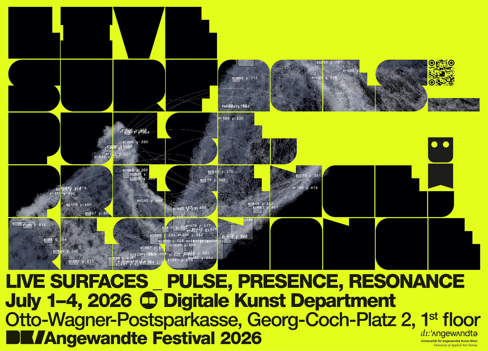

# EXHIBITION at Digitale Kunst 01-04/06/26
# Live Surfaces _ pulse, presence, resonance curated by Burcu Öztürkler

### Opening hours:
01/07, 16:00–21:00

02-03/07, 11:00-21:00

04/07, 11:00-18:00

### Locations
GCP, DK Department and Kassenhalle, Georg-Coch.Platz 2, 1010 Vienna
OKP, main stage, inner courtyard, STAR 6 and STAR 8, Oskar-Kokoschka-Platz 2, 1010 Vienna
VZA7, Auditorium, Vordere Zollamtsstraße 7, 1030 Vienna

### Participants exhibition and projects: 
45 grados, AEON GAWA, AIXENI, Alena Prinz, Amanda Montenegro, Andreas Rippl, Anton Paievski, Bobbie Felstead, Bobby Rajesh Malhotra, David Obradović, Dongjoo Kim, Element Lee, Esma Ahmedi, Franci Kas, Ghanishka Kedar, Ghazal Naemi, Grisha Terno and Roma Bogdanov, Hannah Hutterer, Herner Werzog, Iris Kienzl, Ivan Sai, Jazmín Sanzana, Jens Vetter, Jorge Emilio Yáñez and Victor Badillo, Juárez Suárez, Koschka Cosma Keye, Malpractice, Margherita Pruneti, Mariia Tikhomirova, Matthias Sanoll, MAXX HYPER, NotToday, Oscar Zickler, Ryta Kulyk, Sei Jeung, Sofia Gutierrez Escobar (FIA), Ulrike Fritzsche, Wenlu Sun, Xu Huang, Zira Reyesna, Zita Kayser.

Screens move. Rooms listen. Bodies leave traces in sound, light, and code.
Live Surfaces brings together current artistic positions from within the Digital Arts department — moving image, installations, experimental media practices, and immersive environments — asking what it means for a surface to respond, to remember, to breathe.

Diploma projects and student exhibitions unfold across the department spaces and surrounding areas. A selection of performances explores the body through live, time-based formats and sensor-based interaction. Live coding sessions activate real-time generative visuals and sound production in a temporary audiovisual setup. An improvisational sound happening brings together voices from across the university — electronica, acoustic music, noise, spoken word — in a shared sonic environment.

The program also presents the outcomes of the Collapse Collection workshop by Zora Hünermann & Jakob Margit Wirth, featuring student-developed NFT works, merchandise, and video interventions that explore speculation, value, and participation.

An open space for experimentation, exchange, and public encounter, students, invited artists, and interdisciplinary practices in motion together. The works run, loop, perform, and wait for contact.

 

