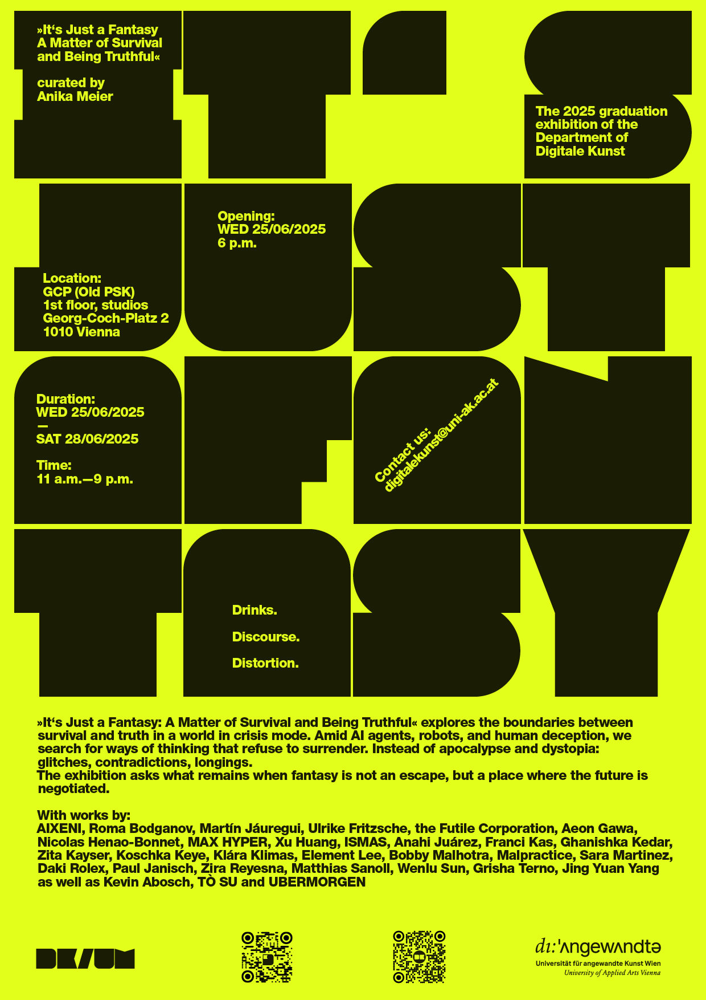

# Angewandte Festival 2025

## EXHIBITION at Digitale Kunst
# It’s Just a Fantasy: A Matter of Survival and Being Truthful

It's Just a Fantasy: A Matter of Survival and Being Truthful traces the line between survival and truth in a world in crisis mode. Amidst AI agents, robots, and human deception, we search for figures of thought that do not capitulate. Instead of apocalypse and dystopia: glitches, contradictions, desires. The exhibition asks what remains when fantasy is not an escape, but a place where future is negotiated. 

## IMMERSION
# The Immersive Lab Presents: Hybrid Happening

Immersive Lab, program everyday from 14:00

## SOUND PIECE I am walking in a house

Digitale Kunst spaces and PSK Kassenhalle

## GROTESKE KRALLEN Workshop

Sat June 28, 12:00 (noon)
Jungle at Digitale Kunst, Georg-Coch-Platz 2, 1 Floor
Max. 10 participants; prior registration required.

## ANDY KASSIER: Identity as a playground Open Lecture

Thu, June 26, 14:00
Immersive Lab, Department Digitale Kunst, Georg-Coch-Platz 2, 1 Floor

## SCIENCE VISUALIZATION LAB / The Big-Bug immersion (INTRA 2023)

Science Visualization Lab, Department Digitale Kunst, Georg-Coch-Platz 2, 1 Floor

## ÆSR Lab / Digitale Kunst / mdw 
Presentations

<!--

## TAVOLATA. On standing out and fitting in

26.06. – 29.06.2024

In the contemporary era, the acknowledgment and appreciation of diversity are widely embraced, yet adhering to societal norms might be perceived as an onerous obligation. In contrast, inclusion represents the act of embracing and understanding others. The Digital Art Table engages in conversations about how to negotiate cultural norms while maintaining our uniqueness. We skillfully balance the act of conforming to social expectations while still expressing our individuality. The round table, an enduring emblem of egalitarianism, fosters discourse and cooperation. Every artwork here holds significance and leads to innovative solutions and a more profound comprehension. You are cordially invited to experience the fusion of artistic expression, culinary delights, and emotional ambiance. The Digital Art Table is available daily starting at 1 p.m. Every day during the festival's operating hours, as well as at different sites within the Angewandte. WELCOME, HAVE YOU MADE A TABLE RESERVATION?

# Collaborative projects

Ferdinand Doblhammer, Hartwin Haselbauer, Lea Karnutsch, Moritz Wunderwald, Thomas Felder, Martina Fröschl, Michael Bachhofer, Nicolaj Kirisits, Mel E. Logan, Sara De Santis, Emanuel Andel, Marie-Claude Poulin, and Patrícia J. Reis.

# Artworks

Mahdi Bakhshi with Golara Ghofrani, Yazdan Asadi & Reihaneh Kosari Mehr, Margo Dubovska, Element Lee, Isidor Forster, Lea Gander, Aisel Gulieva, Franci Kas, Zita Kayser, Kiarer Kristler, David Obradović, Alena Prinz, Rage, Matthias Sanoll, the Futile Corporation, and Moritz Wunderwald.

# Locations

Public space at Georg-Coch-Platz 
Basement, SR35 
Mezzanine: Kassenhalle, APL 
First floor, Department of Digitale Kunst 

# Opening Hours for artworks

daily 11.00 – 21.00

 
 
-->
