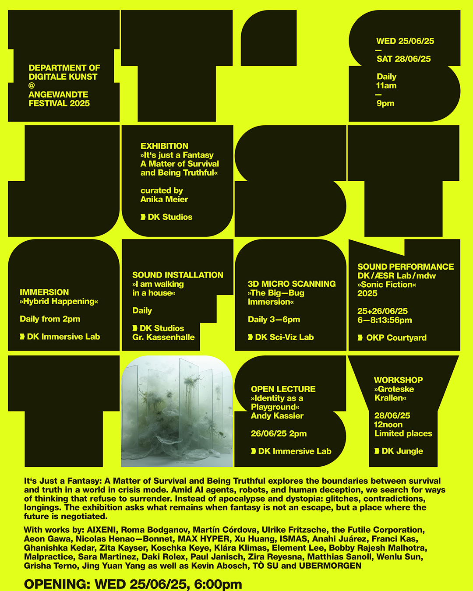

## Angewandte Festival 2026

## LIVE SURFACES_PULSE, PRESENCE, RESONANCE curated by Burcu Öztürkler
Students´ EXHIBITION at Digitale Kunst, 01-04/07/26

### Diploma Showing (AAA-Angewandte Abschluss Arbeiten)
The diploma projects are on show at the Digitale Kunst as part of the AAA 01-04/07/26, 
during the Festival opening hours. Department Digitale Kunst, rooms: 122, 130, 129, Sound Lab, Immersive Lab, Star 6 (OKP), Star 8 (OKP)

### Sonido Chamuco
Live Performance by Zira Reyes Nares
02/07/26, 19:00-22:00, room 169 (DK Kitchen)

### From Beets To Beats - The Crisp Sound Of Plants
Sound Improvisation MAXX HYPER, Margherita Pruneti, Sei Jeung, Sofia Gutierrez Escobar (FIA), Hartwin Haselbauer with Martina R. Fröschl 
03/07/26, 18:00-20:00, Oskar-Kokoschka-Platz, Stage

### Live Coding AV Performance 
Featuring: 45 grados, Nicolás Henao Bonnet, Jens Vetter 
04/07/26, 15:00-18:00, Oskar-Kokoschka-Platz, Courtyard

### Live Surfaces
Students Exhibition

An angel’s wings are like a shark’s teeth/Alena Prinz, Seed Studies Part I/Amanda Montengro, Memplex Zone Version 2.0/Bobby Rajesh Malhotra, Digital Handicraft/Element Lee, becoming digitális szabadságharcos/Franci Kas, Ordnung V1/A Letter to Maria/Hannah Hutterer, Pretty Attractive/Ivan Sai, Scaling/Jazmín Sanzana, Claw Purgatory/ Jorge Emilio Yáñez, Victor Badillo and Amanda Montenegro, MAMA/Juárez Suárez, Isometric Memory Spaces/Mariia Tikhomirova, whatmetaowesyou.org/NotToday, minigolf server/Oscar Zickler, Mannequins/Ryta Kulyk, ICE/Zira Reyesna 
01/07/26, 16:00-21:00, 02+03/07/26, 11:00-21:00, 04/07/26, 11:00-18:00, DK Jungle

BF [butterfly]/AEON GAWA, Retrouvailles/Dongjoo Kim, Sonic Gestures/Margherita Pruneti, LONELY ROOM PROTOCOL/Matthias Sanoll, Will 1,024 Seconds of Gaze Make You Love This Place/Wenlu Sun, Four Phrases/Xu Huang, Im Bade 2026/Zita Kayser
01/07/26, 16:00-21:00, 02+03/07/26, 11:00-21:00, 04/07/26, 11:00-18:00, DK Hallway

DREAMTECH | ASP/AIXENI, Oscillaris/Matthias Sanoll, Speiseeis bei einsetzender Dunkelheit/MAXX HYPER 
01/07/26, 16:00-21:00, 02+03/07/26, 11:00-21:00, 04/07/26, 11:00-18:00, DK Immersive Lab Back Stage

### Immersive Installations - INTERVENTION
Can something random be interpreted as meaningful?/Grisha Terno and Roma Bogdanov, All Inclusive AI Hell Cruise/Malpractice, Poems from a Sushi Shop and Xu´s unofficial Report to Lenin, Winter Twenty Twenty-Five/Xu Huang 
01/07/26, 20:00-21:00, 02-04/07/26, 13:00-14:00, DK Immersive Lab

### The Narrative Network
Collaborative installation 
01/07/26, 16:00-21:00, 02+03/07/26, 11:00-21:00, 04/07/26, 11:00-18:00, DK Research Lab

### Collapse Collection: Take Over
Renés Collapse Collection featuring Margherita Pruneti, Sei Jeung, Ghanishka Kedar, Ghazal Naemi, Koschka Cosma Keye, Ulrike Fritzsche, Juárez Suárez, Roma Bogdanov and Grisha Terno, Jazmín Sanzana, Jorge Emilio Yáñez, Nicolás Henao Bonnet, Dongjoo Kim 
02-04/07/26, PSK Kassenhalle

### Angewandte Video Screening VZA 7
Like, Share and Subscribe/Anton Paievski, Bosnian Pyramid Routine by Daki R./David Obradović, You could have done better/Zita Kayser, Instruments/Ryta Kulyk, Fatigue Archive/Malpractice, Tofuism/Sei Jeung, At the End of Meaning/Herner Werzog, on the lookout/Andreas Rippl, In deiner Nähe/Iris Kienzl 
01-04/07/26, Auditorium VZA7

<!--
# Angewandte Festival 2025

## EXHIBITION at Digitale Kunst OPENING Wed 25/06/25, 6:00 pm
# It’s Just a Fantasy: A Matter of Survival and Being Truthful
# [Curatorial Spaces](https://digitalekunst.click/angewandte-festival/AF2025/17_af_curatorial_spaces/)

It's Just a Fantasy: A Matter of Survival and Being Truthful traces the line between survival and truth in a world in crisis mode. Amidst AI agents, robots, and human deception, we search for figures of thought that do not capitulate. Instead of apocalypse and dystopia: glitches, contradictions, desires. The exhibition asks what remains when fantasy is not an escape, but a place where future is negotiated. 

## [IMMERSION](https://digitalekunst.click/angewandte-festival/AF2025/11_2025_immersion/)
# The Immersive Lab Presents: Hybrid Happening

# Videoscreenings »Fever Dreams« / »Chasing Echoes and Taming Machines« [Lecture Tina Kult] Immersive Lab

Immersive Lab, program everyday from 11:00 -14:00

## [SOUND PIECE I am walking in a house](https://digitalekunst.click/angewandte-festival/AF2025/12_2025_sound_piece/)

Digitale Kunst spaces and PSK Kassenhalle

## [GROTESKE KRALLEN Workshop](https://digitalekunst.click/angewandte-festival/AF2025/13_2025_ws_groteske_krallen/)

Sat June 28, 12:00 (noon)
Jungle at Digitale Kunst, Georg-Coch-Platz 2, 1 Floor
Max. 10 participants; prior registration required: digitalekunst@uni-ak.ac.at

## [ANDY KASSIER: Identity as a playground Open Lecture](https://digitalekunst.click/angewandte-festival/AF2025/14_2025_andy_kassier/)

Thu, June 26, 14:00
Immersive Lab, Department Digitale Kunst, Georg-Coch-Platz 2, 1 Floor

## [SCIENCE VISUALIZATION LAB / The Big-Bug immersion (INTRA 2023)](https://digitalekunst.click/angewandte-festival/AF2025/15_2025_scivizlab/)

Science Visualization Lab, Department Digitale Kunst, Georg-Coch-Platz 2, 1 Floor

## [ÆSR Lab / Digitale Kunst / mdw](https://digitalekunst.click/angewandte-festival/AF2025/16_2025_asr_lab/)
Presentations

## TAVOLATA. On standing out and fitting in

26.06. – 29.06.2024

In the contemporary era, the acknowledgment and appreciation of diversity are widely embraced, yet adhering to societal norms might be perceived as an onerous obligation. In contrast, inclusion represents the act of embracing and understanding others. The Digital Art Table engages in conversations about how to negotiate cultural norms while maintaining our uniqueness. We skillfully balance the act of conforming to social expectations while still expressing our individuality. The round table, an enduring emblem of egalitarianism, fosters discourse and cooperation. Every artwork here holds significance and leads to innovative solutions and a more profound comprehension. You are cordially invited to experience the fusion of artistic expression, culinary delights, and emotional ambiance. The Digital Art Table is available daily starting at 1 p.m. Every day during the festival's operating hours, as well as at different sites within the Angewandte. WELCOME, HAVE YOU MADE A TABLE RESERVATION?

# Collaborative projects

Ferdinand Doblhammer, Hartwin Haselbauer, Lea Karnutsch, Moritz Wunderwald, Thomas Felder, Martina Fröschl, Michael Bachhofer, Nicolaj Kirisits, Mel E. Logan, Sara De Santis, Emanuel Andel, Marie-Claude Poulin, and Patrícia J. Reis.

# Artworks

Mahdi Bakhshi with Golara Ghofrani, Yazdan Asadi & Reihaneh Kosari Mehr, Margo Dubovska, Element Lee, Isidor Forster, Lea Gander, Aisel Gulieva, Franci Kas, Zita Kayser, Kiarer Kristler, David Obradović, Alena Prinz, Rage, Matthias Sanoll, the Futile Corporation, and Moritz Wunderwald.

# Locations

Public space at Georg-Coch-Platz 
Basement, SR35 
Mezzanine: Kassenhalle, APL 
First floor, Department of Digitale Kunst 

# Opening Hours for artworks

daily 11.00 – 21.00

 
 
-->
