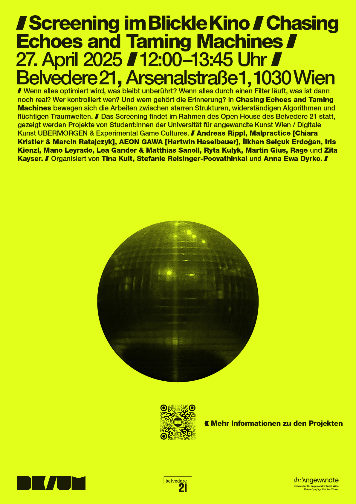

## Videoscreenings »Fever Dreams« / »Chasing Echoes and Taming Machines« [Lecture Tina Kult] Immersive Lab

25.06.2025 14.00   26.06.2025 11.00 27.06.2025 11.00 28.06.2025 11.00

Wenn alles optimiert wird, was bleibt unberührt? Wenn alles durch einen Filter läuft, was ist dann noch real? Wer kontrolliert wen? Und wem gehört die Erinnerung? In _Chasing Echoes and Taming Machines_ bewegen sich die Arbeiten zwischen starren Strukturen, widerständigen Algorithmen und flüchtigen Traumwelten.  
Das Screening findet im Rahmen des Open House des Belvedere 21 statt, gezeigt werden Projekte von Student:innen der Digitalen Kunst und Experimental Game Cultures. Organisation: Tina Kult, Stefanie Reisinger-Poovathinkal und Anna Ewa Dyrko.

Mit Arbeiten von:
