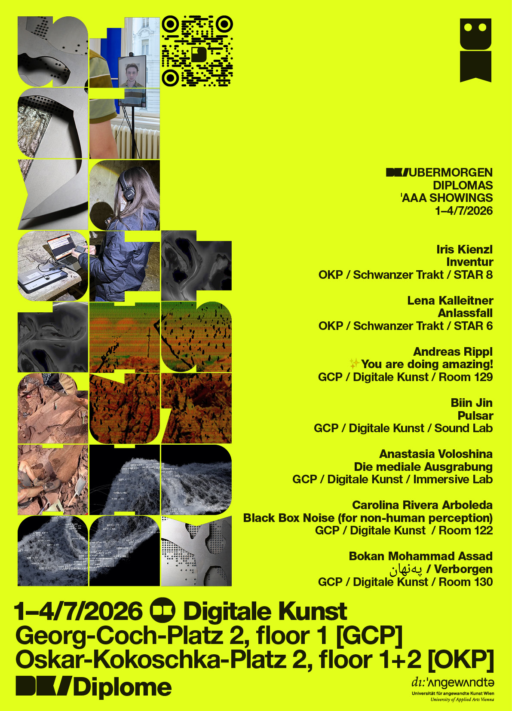
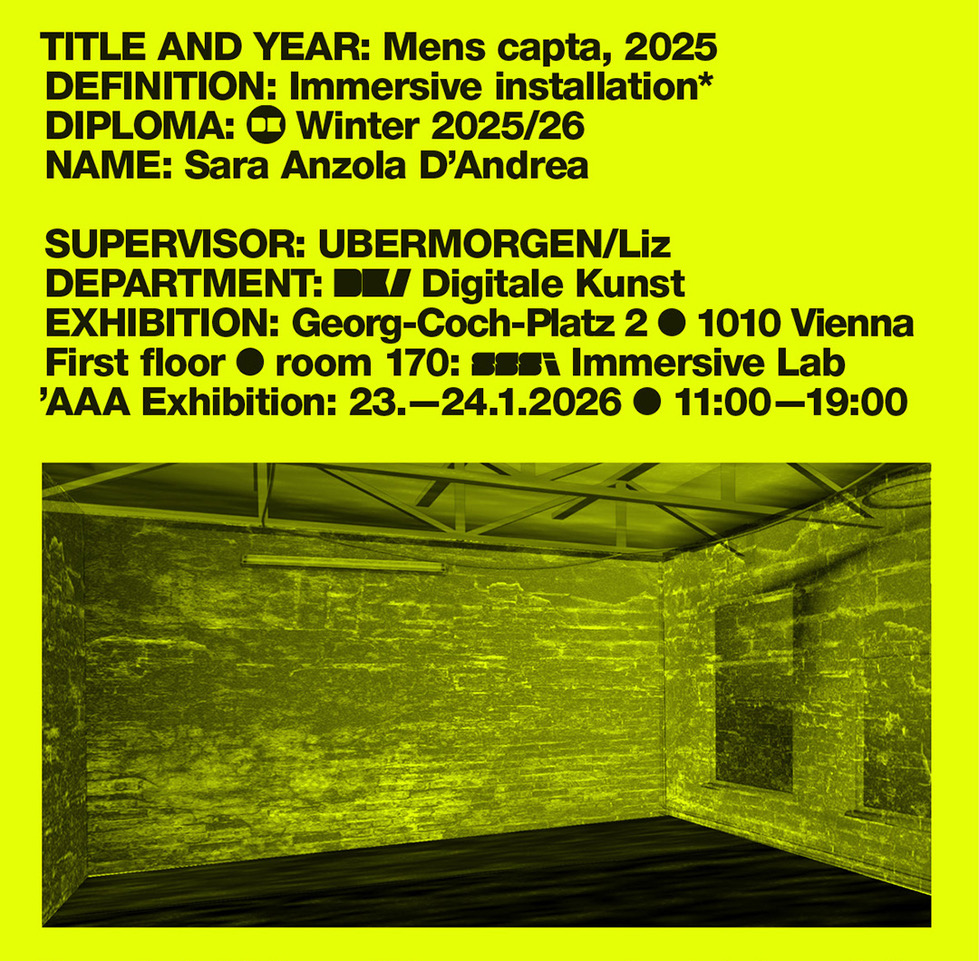
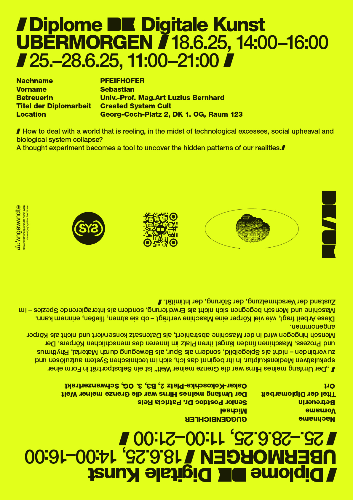

# Diplomas Summer Term 2026

The diploma projects are on show at the Digitale Kunst as part of the AAA (Angewandte Abschluss Arbeiten). 

## Locations: 
Expositur Postsparkasse (PSK), Georg-Coch-Platz 2, 1010 Wien, 1st floor, Digitale Kunst 
Oskar-Kokoschka-platz (OKP), Schwanzer Trakt, 1010 Wien, Star 6, Star 8

Biin Jin
Title: "Pulsar", Location: PSK/DK/SoundArtLab,room 114  
Andreas Rippl 
Title: »✨You are doing amazing!«, Location: PSK/DK/room 129 
Anastasia Voloshina
Title: "Die mediale Ausgrabung",Location: PSK/DK/ImmersiveLab (room 170) 
Calolina Rivera Aboleda
Title: "Black Box Noise (for non-human perception)", Location: PSK/DK/room 122 
Bokan Mohammad Assad
Title: "پەنهان / Verborgen", Location: PSK/DK/Dirty Room (room 130) 
Iris Kienzl
Title: "Inventur", Location: OKP/Schwanzer Trakt/Star 8 
Lena-Maria Kalleitner
Title: "Anlassfall", Location: OKP/Schwanzer Trakt/Star 6

## Showing
01.07 - 04.07 2026, 11:00 – 21:00  

<!--
# Diplomas Winter Term 2025

The diploma project is on show at the Digitale Kunst and as part of the AAA (Angewandte Abschluss Arbeiten). 

Sara Anzola D'Andrea 
Title: Mens Capta 

## Showing
23.01 - 24.01 2026, 11:00 – 19:00  

## Location: Postsparkasse - GCP, Georg-Coch-Platz 2, 1010 Vienna, 1st floor, Immersive Lab, Room 170

# Diplomas Summer Term 2025

Two diploma projects are on show at the Digitale Kunst exhibition and as part of the AAA (Angewandte Abschluss Arbeiten). 

Sebastian Pfeifhofer  
Michael Guggenbichler  

## Showings
18.06.2025, 14.00 – 16.00  
25.06. – 28.06.2025, 11.00 – 21.00  

## Locations

### Postsparkasse - GCP, Georg-Coch-Platz 2, 1010 Vienna:
Sebastian Pfeifhofer: "Created System Cult" // 1st floor, room 123 

### Oskar Kokoschka Platz - OKP, Schwanzertrakt, 1010 Vienna:
Michael Guggenbichler: "Der Umfang meines Hirns war die Grenze meiner Welt" // 3rd floor, B3 

# Diplomas Winter Term 2024
Three diploma projects are on show at the Digitale Kunst exhibition and as part of the AAA (Angewandte Abschluss Arbeiten). 

Stefan Krische  
Emanuel Spurny  
Joanna Zabielska 

## Showings
21.01.2025, 14.00 – 18.00  
24.01. – 25.01.2025, 11.00 – 19.00  

## Locations

### Postsparkasse - GCP, Georg-Coch-Platz 2, 1010 Vienna:
Emanuel Spurny: "Orte 1-4" // 1st floor, room 122/123 
Stefan Krische: "Conflict Pattern Recognition" // 1st floor, room 130 

### Schauraum Angewandte, MQ Schauräume, Museumsplatz 1, 1070 Vienna:
Joanna Zabielska: "POSTGRANICZE. The Borderland of Echoes and Realities" // Schauraum Angewandte, MuseumsQuartier 

# Diplomas Summer Term 2024

Seven diploma projects are on show at the Digitale Kunst exhibition and as part of the Angewandte Festival / AAA (Angewandte Abschluss Arbeiten).

## Dates
18.06.2024, 14.00 – 18.00  
26.06. – 29.06.2024, 11.00 – 21.00 

## Locations

# Postsparkasse - GCP, Georg-Coch-Platz 2, 1010 Vienna: 
Kilian Hanappi: looking for you // 1. OG, Raum 110 
Patryk Senwicki: Synthetic Sibling // 1. OG, Raum 129 
Verena Tscherner: entangle. deflate // 1. OG, Raum 127 

# VZA 7, Vordere Zollamtsstraße 7, 1030 Vienna: 
Hanna Besenhard: Exit House // 4. OG, B 13

# Heiligenkreuzerhof, Schönlaterngasse 5, 1010 Vienna: 
Isabelle Orsini und Rosenberg: Transit // Sala Terrena (daily 14.00 – 18.00)

# OKP, Oskar-Kokoschka-Platz 2, 1010 Vienna: 
Luca Sabot: Apparatus #5 // 6. OG, B1 
Agnieszka Zagraba: The Land of Bearing Shapes // 3. OG, B3
-->

