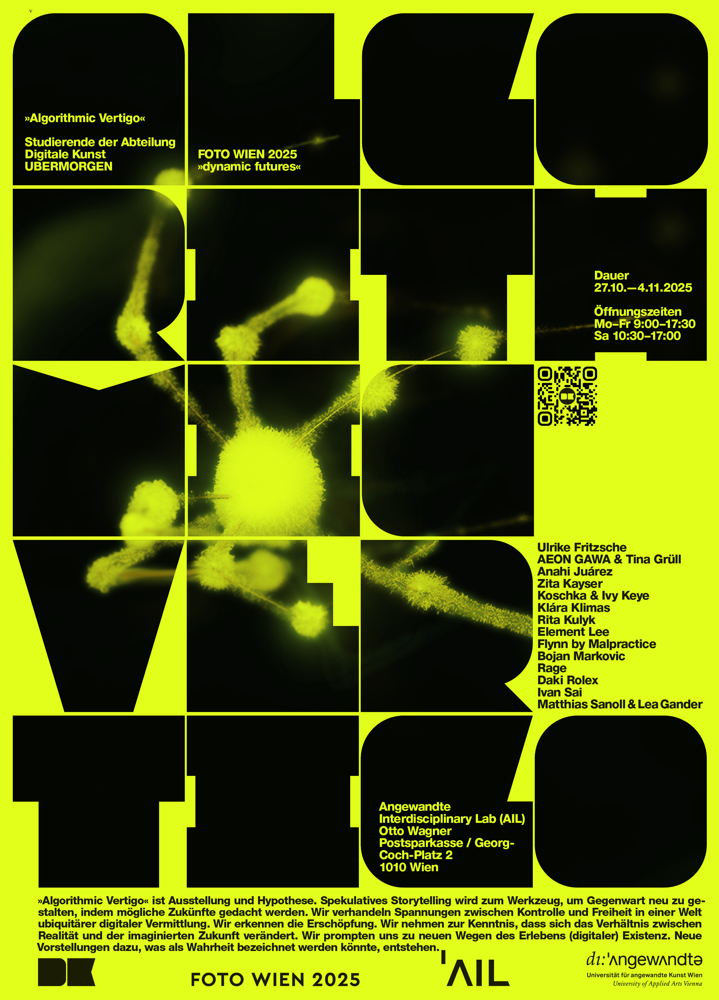

## Algorithmic Vertigo
## A contribution to FOTO WIEN 2025: dynamic futures

27.10.—4.11.2025   

University of Applied Arts Vienna 
AIL Kassenhalle 
Otto Wagner Postsparkasse 
Georg-Coch-Platz 2 
1010 Vienna  

Opening: 27.10.2025, 15:30 
Opening hours: Mon–Fri 9:00–17:30, Sat 10:30–17:00 

Algorithmic Vertigo is an exhibition that operates as an assumption. Speculative storytelling becomes a tool for remoulding the present by imagining possible futures. We address tensions between control and freedom in a world of pervasive digital mediation. We see the fatigue. We acknowledge that the relationship between reality and the imagined future is shifting, we prompt ourselves towards new ways of experiencing (digital) existence. New conceptions of what might be called truth are emerging. 
 
The shown pieces are rooted in current artistic research within experiment-driven learning environments. They are produced or adapted for the occasion and critically reflect on the conditions of the post-digital and its pictorial representations. 
 
The exhibition unfolds within PSK´s Großer Kassensaal. The works are situated in architectural interstices, at thresholds and non-places, fragmentary and resistant to the routines of viewing. They appear as ephemeral tactical gestures, micronarratives within a site shaped by representation. 

Algorithmic Vertigo features works by students of the Digital Arts Department and is part of the biennial festival FOTO WIEN, which runs from October 3 to November 2, 2025, under the main theme dynamic futures. A postcard edition will be launched in cooperation with AIL. 

KuratorInnen: Patricia Köstring und Bernhard Faiss

- [fotowien.at](https://fotowien.at)

 Participating artists:
