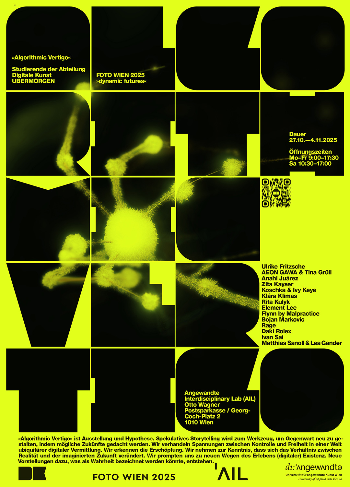

## Ausstellung FOTO WIEN
Algorithmic Vertigo. 
Disruption and Unbounding in the Post-Digital Era
## Die Angewandte / Digitale Kunst / UBERMORGEN 

Alte Postsparkasse, Georg-Coch-Platz 2, 1010 Wien freier Eintritt barrierefrei

27.10.—4.11.2025   Öffnungszeiten Mo - Fr
9:00–17:30 Uhr Sa 10:30-17:00

„Algorithmic Vertigo“ ist Ausstellung und Hypothese. Spekulatives Storytelling wird zum Werkzeug, um Gegenwart neu zu gestalten, indem mögliche Zukünfte gedacht werden. Wir verhandeln Spannungen zwischen Kontrolle und Freiheit in einer Welt ubiquitärer digitaler Vermittlung. Wir erkennen die Erschöpfung. Wir nehmen zur Kenntnis, dass sich das Verhältnis zwischen Realität und der imaginierten Zukunft verändert. Wir prompten uns zu neuen Wegen des Erlebens (digitaler) Existenz. Neue Vorstellungen dazu, was als Wahrheit bezeichnet werden könnte, entstehen. 

Die gezeigten Arbeiten von Studierenden der Digitalen Kunst stehen für Ansätze unserer aktuellen künstlerischen Forschung in experimentellen Lehrumgebungen. Sie wurden für die Foto Wien produziert oder adaptiert und reflektieren kritisch die Bedingungen des Post-Digitalen und dessen bildliche Repräsentationen. 

Die Ausstellung bespielt die Kassenhalle in Otto Wagners PSK. Die Beiträge positionieren sich in architektonischen Zwischenräumen, an Schwellen und Nicht-Orten, fragmentarisch und sich den Routinen des Betrachtens entziehend. Sie sind ephemere taktische Setzungen, Mikronarrative am von Repräsentation geprägten Ort. 

KURATOR:IN: Bernhard Faiss, Patricia Köstring

Mit Arbeiten von:
