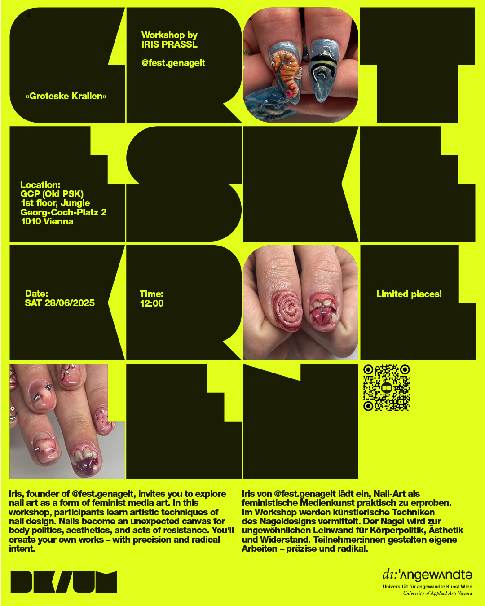

# GROTESKE KRALLEN: fest.genagelt
## Workshop
# Thu, June 28th, 12pm, Department Digitale Kunst, Georg-Coch-Platz 2, 1 Floor

Iris, founder of fest.genagelt, invites you to explore nail art as a form of feminist media art. In this workshop, participants learn artistic techniques of nail design. Nails become an unexpected canvas for body politics, aesthetics, and acts of resistance. You'll create your own works – with precision and radical intent.
