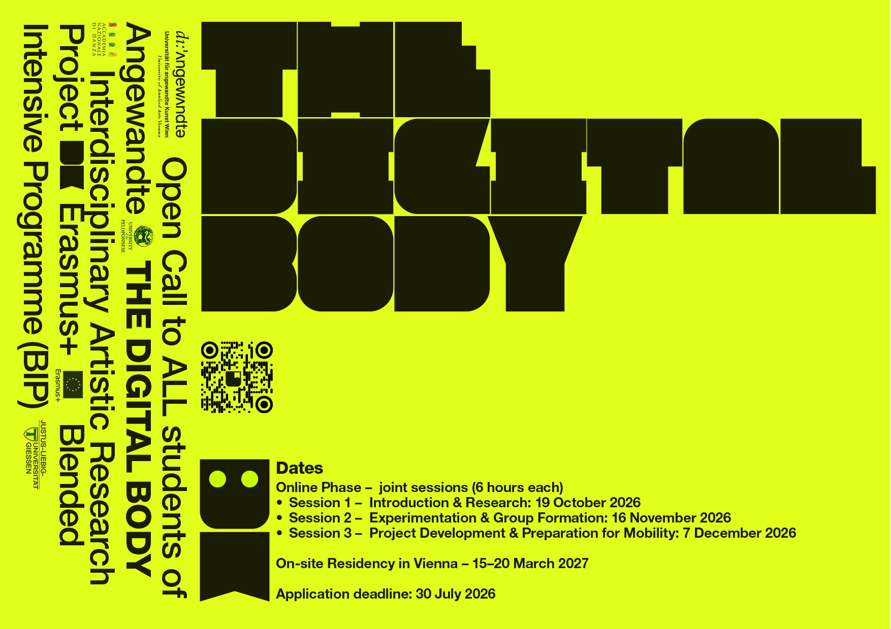

## Open Call to all Students of the Angewandte
## THE DIGITAL BODY
Interdisciplinary Artistic Research Project
Erasmus+ Blended Intensive Programme (BIP)

## Application deadline: 30 July 2026

# About the Project 

The Digital Body is an interdisciplinary artistic research project exploring the relationship between body and digital environments.
Bringing together students of digital arts, theatre, and dance from four European universities, the project creates a shared experimental space where different practices meet, interact, and transform one another.
Through collaboration, participants develop a common vocabulary — a set of communication tools grounded in practice, experimentation, and reflection.
Project lead: Sara de Santis, Digitale Kunst Department [DK]
Partner Institutions
The Digital Body brings together four universities across the EU:
	• University of Applied Arts Vienna (AT) — Department of Digital Arts [DK] — host institution
	• Justus Liebig University Giessen (DE) — Institute for Applied Theatre Studies
	• University of the Peloponnese (GR) — Department of Theatre Studies
	• National Academy of Dance in Rome (IT)

# Who Should Apply

This call is for students of the Angewandte — from all departments.
We would like you to bring know-how in a technology you want to use. We work with tech, we don’t teach it. Which technology is up to you.
Participation means committing to all phases of the project: the three online sessions and the residency week in Vienna.
What We Offer
	• Collaboration with 20 students travelling to Vienna from our three partner universities
	• A hybrid learning format combining online sessions, remote collaboration, and an intensive on-site residency
	• Mentoring by professionals from different disciplines
	• A collaborative, peer-to-peer learning environment
	• The opportunity to present work in a public format (Open Lab)

  
# How to Apply
Please submit:
	• A motivational letter (1 page)
	• A portfolio or examples of previous work — artistic, practical, scientific; any form welcome
	• Your ideas or concepts on how to use technology in the context of this project
Application deadline: 30 July 2026
Submit to: digitalekunst@uni-ak.ac.at — subject: The Digital Body
Format: PDF and links to projects

# Dates

Online Phase — joint sessions (6 hours each)
	• Session 1 — Introduction & Research: 19 October 2026
	• Session 2 — Experimentation & Group Formation: 16 November 2026
	• Session 3 — Project Development & Preparation for Mobility: 7 December 2026 On-site Residency — Vienna
	• 15–20 March 2027

# Selection

10 students from the University of Applied Arts Vienna will be selected, joining 20 students from the three partner universities for a total cohort of 30.
Selection is based on:
	• motivation
	• openness to interdisciplinary collaboration
	• diversity of practices represented in the cohort
Notification: All applicants will be informed of the outcome by 15 August 2026.
Contact
For questions about the programme: sara.desantis@uni-ak.ac.at
To send your application: digitalekunst@uni-ak.ac.at
We are looking forward to meeting you —
to the bodies, practices, and questions you will bring into this shared space.

In partnership with:
Erasmus+ European Union
Die Angewandte
JLU Giessen
University of the Peloponnese
Accademia Nazionale di Danza, Roma

