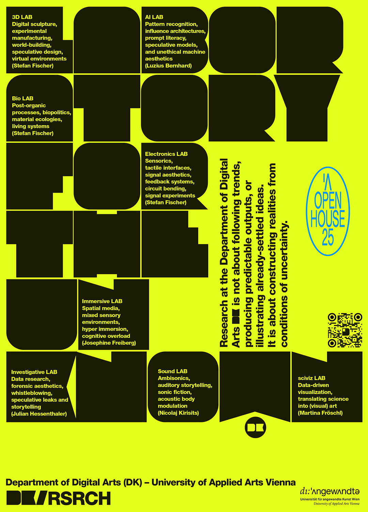

## Open House 2025 04.11.2025

At the Open House the Angewandte opens its doors and is aimed at everyone who wants to get to know the courses on offer at the Angewandte or simply wants to take a look behind the scenes – into the studios, workshops and departments of the University of Applied Arts Vienna.

Wir führen durch die Klasse und geben euch Einblicke in unsere Labs, ihr könnt in eine Lehrveranstaltung hineinschnuppern, es gibt Mappengespräche, Austausch mit Lehrenden und Studierenden der Digitalen Kunst, Snacks und jede Menge Interessantes. We will guide you through the class and give you insights into our labs, you can get a taste of a lecture, there will be portfolio discussions, exchanges with teachers and students of digital art, snacks and lots of interesting things. Os guiaremos por la clase y os daremos una visión general de nuestros laboratorios, podréis echar un vistazo a una clase, habrá charlas sobre carpetas, intercambio con profesores y estudiantes de arte digital, aperitivos y muchas cosas interesantes.

Programme

11:00 a.m. - 6:00 p.m.  
Ausstellung FOTO WIEN
Algorithmic Vertigo. Disruption and Unbounding in the Post-Digital Era, PSK Kassenhalle, Georg-Coch-Platz 2, 1010 Vienna
https://fotowien.at/ausstellung/algorithmic-vertigo-disruption-and-unbounding-in-the-post-digital-era-foto-wien-2025/

2:00 p.m. - 4:00 p.m. 
Portfolio reviews, Digital Art Department, PSK Georg-Coch-Platz 2, 1010 Vienna, 1st floor, room 124

2:00 p.m. - 4:00 p.m. 
Portfolio reviews with teachers from the Digital Art Department, PSK Georg-Coch-Platz 2, 1010 Vienna, 1st floor, room 124

2:00 p.m. - 4:00 p.m.
Portfolio reviews via Zoom : 
https://dieangewandte-at.zoom.us/j/66392087820
Meeting ID: 663 9208 7820

4:30 p.m. – 5:30 p.m.
Laboratory for the unknown – DK/Research: Open Labs
Come and explore our Labs, Tea-Time and Snacks with our students

## From 10:00. See you there, bis dann, nos vemos, vidimo se!

<!--
## Open House 2024 05.11.2024

At the Open House the Angewandte opens its doors and is aimed at everyone who wants to get to know the courses on offer at the Angewandte or simply wants to take a look behind the scenes – into the studios, workshops and departments of the University of Applied Arts Vienna.

On November 5, which is also Guy Fawkes Day & US Election Night, we welcome you at Digitale Kunst with open Labs, open kitchen, open doors. We’ll guide you through the premises; there are donuts, inserts, Q&A, and conversations. Wir empfangen Euch mit open Labs, offener Küche, offenen Türen. Wir führen durch die Klasse, es gibt Donuts, Inserts, Q & A und Gespräche. Le damos la bienvenida con labs abiertos, cocina abierta, puertas abiertas. Te guiamos por los espacios; habrá donuts, inserts, Q&A y conversaciones. Dočekujemo te s otvorene laboratorije, otvorena kuhinja, otvorena vrata. Vodimo vas kroz ucionice! Na raspolaganju su vam slatke krofnice i umetnost! Stojimo vam na raspolaganju ako imate pitanja! (Q & A)

## From 10:00. Open end. See you there, bis dann, nos vemos, vidimo se! -->
