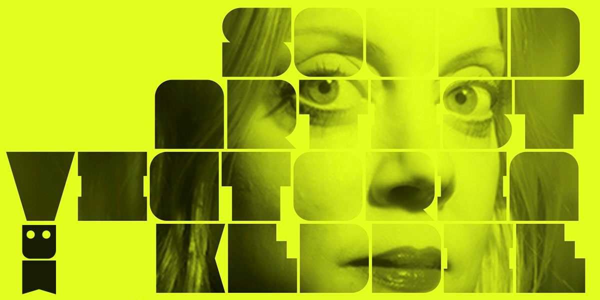

## Sound Artist Victoria Keddie 12.06.2026
15:00-17:00
Digitale Kunst Department, Immersive Lab

# Lecture Performance  

The Digitale Kunst Department at the University of Applied Arts Vienna is inviting a timely artist working in speculative, experimental phonetics and media history and whose work is often outside stable linguistic structures. While investigating how meaning emerges through resonance, gesture, and spatial occupation, Victoria Keddie's work does not stop at the crossroads of sound, video and performance, it moves into neural learning systems, foregrounding adaptation and perceptual drift within spoken language. A recurring theme in Keddie's work is examining acoustic phenomena, and her current projects navigate the acoustic complexity of language and dialects.

# Biography

For over a decade, Keddie was co-director of e.s.p. tv, exploring the televisual medium for performance and sound. Additionally, she's a curator and educator, organizing exhibitions and events at various institutions including MoMA PS1, Storefront for Art and Architecture, and Pioneer Works. Keddie has performed and exhibited internationally. Recent fellowships include the nysca/nyfa for music/sound (2022), the Max Planck institute for empirical aesthetics (2023), and the bemis center for contemporary art, sound art and experimental music fellowship (2024). The Immersive Lab of Digitale Kunst happily welcomes her to Vienna for this performance lecture which is also open to the public.

www.victoriakeddie.com
www.bemiscenter.org/residents/victoria-keddie

